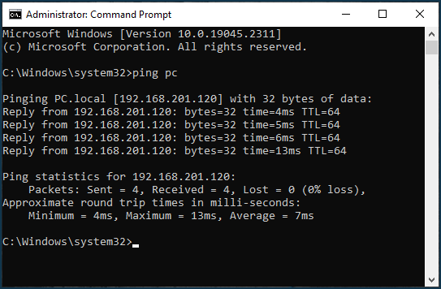
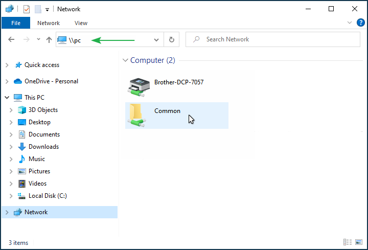
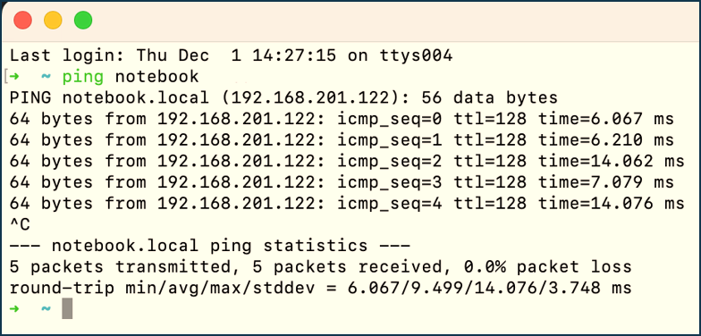
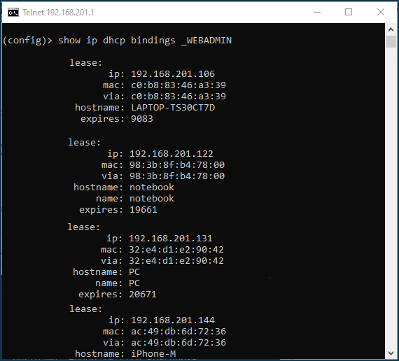
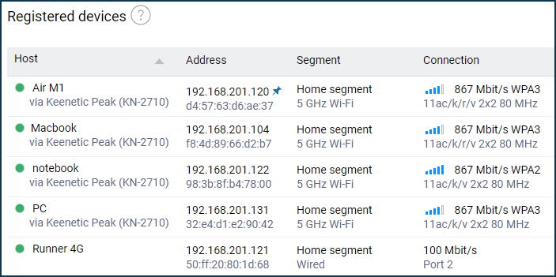

# Accessing a network device by its hostname

<https://help.keenetic.com/hc/en-us/articles/360011129420-Accessing-a-network-device-by-its-hostname>

Last update 12/05/2022

[FOLLOW](https://help.keenetic.com/hc/en-us/articles/360011129420-Accessing-a-network-device-by-its-hostname/subscription.html)

Question: Can I use Keenetic's built-in DNS server to set up an automatic hostname to IP address mapping in a DHCP request? I need it to address any other host on the local network by network name rather than IP address, which can change when dynamically assigned and not bound to a specific IP address. For example, specify '\\server' in the address bar of Windows Explorer and see a list of shared folders on the server.

Answer: Yes, this can be set up on your Keenetic router. This setup is not about making a dedicated [WINS server](https://en.wikipedia.org/wiki/Windows_Internet_Name_Service). It can be done through the router's [command-line interface](https://help.keenetic.com/hc/en-us/articles/213965889) (CLI).

You can allow Keenetic to add static DNS proxy entries when issuing DHCP addresses. This feature is disabled by default. To enable it, use the command:

```text
(config)> ip dhcp pool _WEBADMIN update-dns
```

And a command to save the settings:

```text
(config)> system configuration save
```

In this case, it will be possible to access hosts (or terminals) by their default hostname (the hostname from the DHCP request).

**Important!** Once this command is enabled, it will apply to devices newly connected to the router via DHCP. We recommend rebooting the router after making the above settings.

On a Windows computer, run the command to clear the DNS cache (this must be done from the Windows command prompt) before checking the access to a network device by hostname:

```text
ipconfig /flushdns
```

Afterwards, check the automatic recognition of network host names on the router's LAN using the ping command.

Here is an example. Suppose you have a PC and a laptop on your network which use the hostname 'PC' and 'Notebook' respectively (e.g. in your network, it could be a server with the hostname 'SERVER').
Let's activate the command mentioned above in the router and reboot it.
From the laptop, run the **ping pc** command to ping the computer.



By typing **\\pc** in the address bar of Windows Explorer, you will see a list of shared network resources.



Now from the computer, run **ping notebook**.



As we can see, hostname and IP address mapping is automatically triggered.

In addition to enabling the hostname and IP address mapping mechanism in a DHCP request, it is possible to configure hosts on the local network to be assigned a specific domain name in DHCP requests automatically. Refer to the instructions [Setting up DHCP Option 15](https://help.keenetic.com/hc/en-us/articles/214471085) for details.

**Important!** Keenetic will access the **hostname** parameter. In the web interface on the [Device Lists](https://help.keenetic.com/hc/en-us/articles/360000489679) page, you can set and change another parameter – **name**. In the router CLI command **show ip dhcp bindings _WEBADMIN** shows that these are two different fields:





When a host is registered in 'Device lists', the *hostname* field is copied to *name,* which is the same in this case. But as soon as the user changes *hostname* on the 'Device Lists' page, this change is written to *name* field, and there will be no mapping of the domain name and IP address by this name. You will need to add another DNS record to the desired host in the CLI using the **ip host** command or change the hostname parameter directly on the host.

**Note**

If the default host or terminal name is not set, you can set it in Keenetic using the **ip host** command.

To do this, you need to do the following:

Register on the router and assign a permanent IP address to the desired host. Also, you can register in the [web interface](https://help.keenetic.com/hc/en-us/articles/360001923020) on the [Device lists](https://help.keenetic.com/hc/en-us/articles/360000394159) page. After registration, the specified device will permanently receive the same IP address from the router.

Then connect to the [command-line interface](https://help.keenetic.com/hc/en-us/articles/213965889) (CLI) of the router and run the following commands:

```text
(config)> ip host <host_domain_name> <address>
(config)> system configuration save
```

We recommend that you specify the host's domain name in the 2nd-level domain name format*in the form*localhost.localdomain* (for example, my.comp, test.local, host.test, pc.example).

```text
(config)> ip host my.comp 192.168.1.33
Dns::Manager: Added static record for "my.comp", address 192.168.1.33.
(config)> system configuration save
Core::ConfigurationSaver: Saving configuration...
```

Using the above commands, we added the host domain name and IP address to the DNS table on the router. In our example, my.comp is the host's domain name with the IP address 192.168.1.33.

\* *The recommendation in the **ip host** command to use the hostname in the 2nd-level domain name format is related to the peculiarity of the Windows operating system. When accessing 1st-level domain names, the system sends LLMNR (Link-Local Multicast Name Resolution) requests or NBNS (NetBIOS Name Service) if LLMNR is disabled, and the host will not be detected during ping verification. Therefore, for correct work in Windows, it is recommended to use 2nd-level domain names in **ip host** entries.*

In the local network of the Keenetic router, it will now be possible to access the desired host/terminal by the domain name.

Ping a host by the domain name in Windows:

```text
 C:\Users\User> ping -n 5 my.comp

Pinging my.host [192.168.1.33] with 32 bytes of data:
Reply from 192.168.1.33: bytes=32 time=57ms TTL=64
Reply from 192.168.1.33: bytes=32 time=5ms TTL=64
Reply from 192.168.1.33: bytes=32 time=5ms TTL=64
Reply from 192.168.1.33: bytes=32 time=83ms TTL=64
Reply from 192.168.1.33: bytes=32 time=5ms TTL=64

Ping statistics for 192.168.1.33:
    Packets: Sent = 5, Received = 5, Lost = 0 (0% loss),
Approximate round trip times in milli-seconds:
    Minimum = 5ms, Maximum = 83ms, Average = 31ms
```

Ping a host by the domain name in Linux:

```text
[comp@comp-lnx ~]$ ping -c 5 my.comp
PING my.host (192.168.1.33) 56(84) bytes of data.
64 bytes from 192.168.1.33 (192.168.1.33): icmp_seq=1 ttl=128 time=0.342 ms
64 bytes from 192.168.1.33 (192.168.1.33): icmp_seq=2 ttl=128 time=0.508 ms
64 bytes from 192.168.1.33 (192.168.1.33): icmp_seq=3 ttl=128 time=0.331 ms
64 bytes from 192.168.1.33 (192.168.1.33): icmp_seq=4 ttl=128 time=0.427 ms
64 bytes from 192.168.1.33 (192.168.1.33): icmp_seq=5 ttl=128 time=0.414 ms

--- my.host ping statistics ---
5 packets transmitted, 5 received, 0% packet loss, time 56ms
rtt min/avg/max/mdev = 0.331/0.404/0.508/0.066 ms
```

**Important!** If **ICMP Echo-Request** packets are not reaching the host in the [Ping](https://en.wikipedia.org/wiki/Ping_(networking_utility)) utility, you should check the configuration of the firewall's allow filtering rule on the host side for the [ICMP (Internet Control Message Protocol)](https://en.wikipedia.org/wiki/Internet_Control_Message_Protocol).

**Important!** This scheme will only work if the IP address of the Keenetic router is set as the preferred DNS server of the local network hosts.

In Keenetic routers, you can add up to 64 entries using the **ip host** command.

You can see all static DNS entries of the **ip host** command in the router's system configuration file [startup-config.txt](https://help.keenetic.com/hc/en-us/articles/360000575200) or by using the **show dns-proxy** command (this command displays a lot of information other than static DNS entries).
