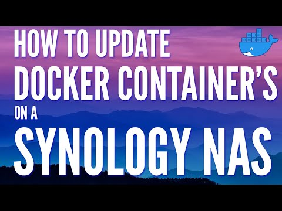
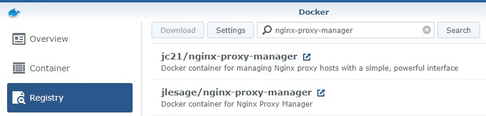
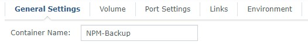
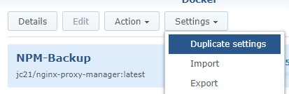
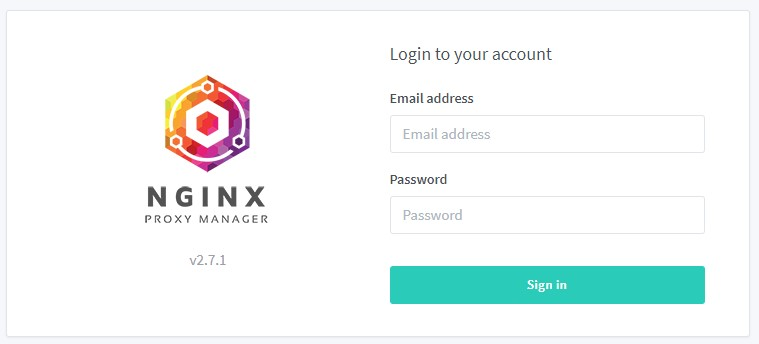
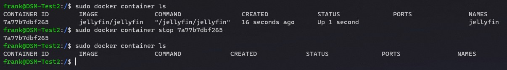
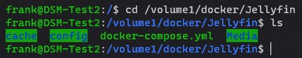

# How to Update Docker Containers on a Synology NAS

- Post author:[WunderTech](https://www.wundertech.net/author/moneymanipulator/)
- Post last modified:November 2, 2022
- Post category:[Synology](https://www.wundertech.net/category/synology/)
- <https://www.wundertech.net/how-to-update-docker-containers-on-a-synology-nas/>

- [How to Update Docker Containers on a Synology NAS](#how-to-update-docker-containers-on-a-synology-nas)
  - [How to Update Docker Containers on a Synology NAS Using the Docker Application](#how-to-update-docker-containers-on-a-synology-nas-using-the-docker-application)
  - [How to Update Docker Compose Containers on a Synology NAS](#how-to-update-docker-compose-containers-on-a-synology-nas)
  - [Conclusion – How to Update Docker Containers on a Synology NAS](#conclusion--how-to-update-docker-containers-on-a-synology-nas)

Today we are going to look at two different ways on how to update [Docker containers](https://www.wundertech.net/tag/docker/) on a Synology NAS.



Last week, we looked at how to [install Docker containers on a Synology NAS](https://www.wundertech.net/how-to-use-docker-on-a-synology-nas/). I excluded this portion as I felt it deserved its own tutorial. I will preface this by saying there are various methods online on how you can update containers on a Synology NAS and that this is my preferred approach. This approach gives me a full rollback plan if I experience any issues with the new version, which a lot of other “update” solutions do not provide.

I normally install the new container, let it run for a few days to ensure that everything works as expected, and then delete the old container. If I run into any issues (I have run into issues with new versions of containers before), I delete the new container, rename my old container, and then I’m back to using the old container without any issues.

**Before you get started with an update, always back up the docker folder on your Synology NAS.**

**Table of Contents** [show](https://www.wundertech.net/how-to-update-docker-containers-on-a-synology-nas/#)

## How to Update Docker Containers on a Synology NAS Using the Docker Application

1. I will be displaying how to do this using Nginx Proxy Manager since the version number is directly on the login page. My container is currently using v2.5.0.

    

2. Open the registry, search for the container that you’d like to update, and double-click it to download the latest version. The latest version will overwrite your existing version. Make sure you give it a little while to finish the download.

    

3. **Stop** the old container, **Edit** it, and rename the container. I normally leave it as-is and add **-Backup** to the name.

    

4. When the container is renamed, select the container, then select **Settings**, and then **Duplicate** **Settings**. Give the new container a name (I normally use the old name), select **Apply** and then the container will install! When you run the new container, you will be using the latest version!

    

5. The container is now setup! If you run into any issues, delete the new container, rename the old one back (by removing -Backup) and you will be fully rolled back to the old version of the Docker container.

    

## How to Update Docker Compose Containers on a Synology NAS

Updating a container using [Docker Compose](https://docs.docker.com/compose/) is slightly different than running Synology’s GUI. When we use Synology’s GUI and duplicate the settings, we are technically creating an entirely new container and keeping our old one as well. Since Docker Compose uses our configuration file to create the container, it’s not easy to do that.

For that reason, it’s almost easier to update the container and fix it (update the Docker Compose file to use an old version) if there’s a problem, rather than preemptively plan for it. This is only my personal opinion of course! If you’d prefer to take a backup of the container, rename the container’s folder on your Synology NAS, copy it to a new location, and then create the new container as shown in [our last tutorial](https://www.wundertech.net/how-to-use-docker-on-a-synology-nas/).

1. Get a list of running containers.

    ```sh
    sudo docker container ls
    ```

2. **Stop** the container that you’d like to update by running the command below and substituting the correct **container ID**.

    ```sh
    sudo docker stop [CONTAINER_ID]
    ```

    

3. Navigate to the folder where the Docker Compose file exists.

    ```sh
    cd /volume[#]/docker/[CONTAINER_FOLDER]
    ```

    

4. Run the commands below. The first command will pull the latest image and the second will install the package.

    ```sh
    sudo docker-compose pull
    sudo docker-compose up --force-recreate --build --detach
    ```

5. The container will now be updated and running!

## Conclusion – How to Update Docker Containers on a Synology NAS

This tutorial showed how to update Docker containers on a Synology NAS. Like I said initially, this is only my preferred approach and doesn’t mean it’s the only way of doing it.

Thank you for reading the tutorial. As always, if you have any questions, please leave them in the comments!
