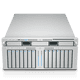
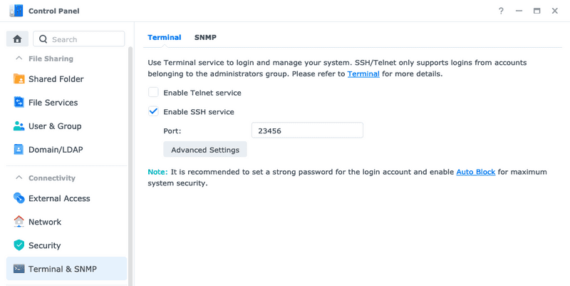
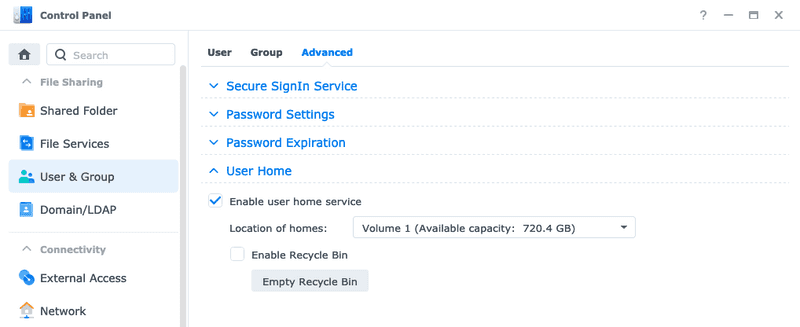

# Log in with ssh key authorization on a Synology NAS



<https://samuelsson.dev/log-in-with-ssh-key-authorization-on-a-synology-nas/>

📆2021-03-31🍱[server](https://samuelsson.dev/categories/server)

[ssh](https://samuelsson.dev/tags/ssh)[synology](https://samuelsson.dev/tags/synology)[security](https://samuelsson.dev/tags/security)

The operating system of a Synology NAS, *DiskStation Manager*, is a great web-based GUI making it easy for everyone to manage their NAS. However, sometimes it's preferable to access the NAS through SSH instead of the GUI. Logging in with password is fairly simple to activate but in the long run it's often better to use key authorization instead of having to type your (long and secure) password each time.

If you haven't already, we need to activate the SSH service from within DSM. In the screenshot below I am using DSM 7 and the SSH settings can be found under `Control Panel > Terminal & SNMP > Terminal`.



Just check the checkbox and also it's good practice changing the default port to something other than the default one, even if you only accessing it locally.

You can now log in through SSH with `ssh username@192.168.1.123 -p 23456`, if you change the values to match your username, IP and port of course 😉 Also you must be a user of the administrator group (not the actual admin user) but that should be the default in DSM 7.

## Generate a new ssh key on your computer

On the device you will be using to access the NAS you need to create a new pair of public and private keys. You can read all about it [here](https://samuelsson.dev/generate-and-organize-ssh-keys-on-mac/) but if you want the short version it is just this command.

```bash
ssh-keygen -t rsa -b 4096 -C "An optional comment about the key"
```

The public part of they key will then be saved under `~/.ssh/id_rsa.pub` if nothing else is specified by you.

## Enable key authorization on the NAS

Because we are using our self-created user(s) for accessing the NAS instead of the admin we need to enable a way to connect the generated key to a user. One way of doing this is enabling the *homes* for our DSM users, this way each one will have their own "personal space" where we can save user specific files, just like in a normal Linux installation. Enable them under `Control Panel > User & Group > User Home`.



This will create new shared folders for each of the users in DSM (except the guest user). As default the permissions of the home directories are way too open for storing and managing ssh keys, so we need to restrict them to only allow access for their respective owners.

Don't change any other permissions than your own home folder to avoid breaking things.

Log in to the NAS through SSH with the user you want to add key authorization for and make the home directory of this user only visible to the one you are logged in as.

```bash
chmod 700 ~
```

Then let's create a new directory for storing our ssh related files.

```bash
mkdir ~/.ssh
```

And also making sure the permissions are correct here.

```bash
chmod 700 ~/.ssh/
```

Next step is creating a file containing public keys for those allowed to connect without password, like "if you are on the list to access the club". This list is called `authorized_keys`.

Let's open an editor to edit this file.

```bash
vim ~/.ssh/authorized_keys
```

Now you need to paste the **public** key you generated on your own computer before. If you are on a Mac you can open a new terminal window and copy the public key, `cat ~/.ssh/id_rsa.pub | pbcopy`, then paste it into `authorized_keys` on the NAS. You can also use tools like `scp` to transfer the public key to the NAS. Save the file and make sure it has the correct permissions.

```bash
chmod 600 ~/.ssh/authorized_keys
```

If you disconnect from the NAS and try to connect again you should be able to connect without having to enter your password. We will not disable the possibility to use passwords all together in this article.

## If it doesn't work

- Make sure the permissions of the home folder content on the NAS are correct. They should be `700` for folders and `600` for files.
- Make sure you copied the *public* key from your computer to the `authorized_keys` on the NAS.
- When you are connecting you need to specify the port with the `-p` flag, `ssh username@ip -p 23456`.
