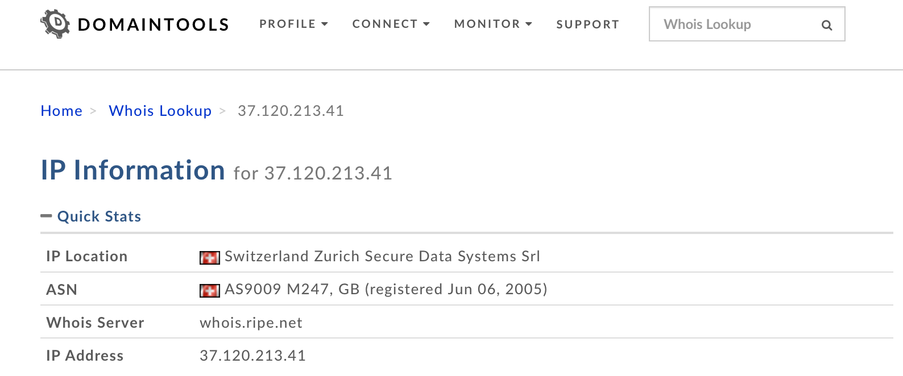

# qBittorrent via VPN docker container running on Synology NAS

- 

  <https://www.blackvoid.club/qbittorrent-via-vpn-docker-container-running-on-synology-nas/>

## Luka Manestar

  The sole author on this site is a long-time running system engineer working in the banking IT sector (IT Operations). Passionate about Mac, NAS/SAN, virtualization, and Docker environments.

  [More posts](https://www.blackvoid.club/author/rusty/) by Luka Manestar.

  

### [LUKA MANESTAR](https://www.blackvoid.club/author/rusty/)

17 MAY 2020 • 13 MIN READ


## Table of Contents

[Running container UI on a custom non-8080 port](https://www.blackvoid.club/qbittorrent-via-vpn-docker-container-running-on-synology-nas/#customport)
[Check the tun module status](https://www.blackvoid.club/qbittorrent-via-vpn-docker-container-running-on-synology-nas/#tun)
[How to check if you are running inside the VPN?](https://www.blackvoid.club/qbittorrent-via-vpn-docker-container-running-on-synology-nas/#check)
[UPDATE: How to use this VPN qBittorrent container as a gateway for any other container](https://www.blackvoid.club/qbittorrent-via-vpn-docker-container-running-on-synology-nas/#gateway)
[UPDATE: How to run NordVPN via Lynx protocol with Transmission client](https://www.blackvoid.club/qbittorrent-via-vpn-docker-container-running-on-synology-nas/#lynx)
[UPDATE: How to run NordVPN via OpenVPN protocol with qBittorrent client (suitable for DSM7 restricted mode)](https://www.blackvoid.club/qbittorrent-via-vpn-docker-container-running-on-synology-nas/#vpndsm7)

------

📢

**UPDATE**: added warnings for running these examples under DSM 7! Changes to the **privileged:true** and the need for **cap_add** and **devices** parameters

📢

**UPDATE**: added a docker-compose stack that runs **NordVPN** via **OpenVPN** protocol in a combination with a **qBittorrent** client

📢

**UPDATE**: added a docker-compose stack that runs **NordVPN** via their **Lynx** (**Wireguard**) protocol for faster downloads in a combination with a **Trasmission** client

📢

**UPDATE**: added an alternative docker-compose section in case you want to run this container on a custom non-8080 port: "**Running container UI on a custom non-8080 port**"

📢

**UPDATE**: added section on the bottom about using this VPN container as a gateway for any other container in order to tunnel that traffic inside VPN as well

------

🗒️

**NOTE**: With the new **DSM 7** most containers that run in **privileged mode will not work**. Because of that, I have added a few images **on the bottom** that runs fine in DSM 7 so consider running them. Those images are a **combination of two containers (VPN and client)** that run as a single stack. You can run it using the **Portainer** platform that can be configured following the article [here](https://www.blackvoid.club/portainer-docker/).

------

Personally, I don’t use torrents. My preferred choice is Usenet. Still, every now and then people tend to ask me how to set up docker containers, and most often is how to set up a torrent client with VPN protection.

I have written in the [past](https://www.blackvoid.club/vpn-or-how-to-access-your-data-securely-the-right-way/) how to utilize VPN on your NAS and one method of tunneling your torrent traffic via your NAS and a VPN connection is using a VDSM instance that will be protected with a VPN and in return, any other app running under that VDSM instance will be protected as well.

Now, this is useful if you will be using that same instance for more than just torrenting. If you are looking for an occasional torrent download, then maybe a docker container will be far less resource demanding, not to mention that you will not need a VDSM license (unless you have the free license still open to use).

In these steps, I will explain a bit how to use qBittorrent client in a combination with a VPN provider of your choice. For this, I will use [https://hub.docker.com/r/markusmcnugen/qbittorrentvpn](https://hub.docker.com/r/markusmcnugen/qbittorrentvpn?ref=blackvoid) image.

1. Download the image from docker repository
2. Log into your NAS via SSH and elevate to root
   a) use sudo -i to get root access
3. Create openvpn folder inside the future /config location where you will copy your OVPN file of choice
4. Run the following docker run as a single line and change the settings to match your needs.

```bash
docker run --privileged -d \
              --name=qbittorrent
              -v /your/config/path/:/config \
              -v /your/downloads/path/:/downloads \
              -e "VPN_ENABLED=yes" \
       -e "VPN_USERNAME=your_VPN_username" \
       -e "VPN_PASSWORD=your_VPN_password" \
              -e "LAN_NETWORK=192.168.1.0/24" \
              -e "NAME_SERVERS=8.8.8.8,8.8.4.4" \
              -p 8080:8080 \
              -p 8999:8999 \
              -p 8999:8999/udp \
              markusmcnugen/qbittorrentvpn
```

🗒️

**DSM 7 changes** to the above docker run command line! The above docker run is for DSM 6! If you are running on DSM 7 please remove **--privileged** switch, and add **--cap-add=NET_ADMIN** as well as **--device=/dev/net/tun**.

Keep in mind that you need to run this as a single line so just delete each \ and replace it with a single space

Or run the following docker-compose file (via [Portainer](https://www.blackvoid.club/portainer-docker/) stacks option for example):

```yaml
version: "3.5"

services:
  qbittorrent:
    image: markusmcnugen/qbittorrentvpn:latest
    network_mode: "bridge"
    privileged: true
    container_name: qbittorrent
    volumes:
      - "/your/config/path/:/config"
      - "/your/downloads/path/:/downloads"
    ports:
      - "8080:8080"
      - "8999:8999"
      - "8999:8999/udp"
    environment:
      - "VPN_ENABLED=yes"
      - "VPN_USERNAME=your_VPN_username"
      - "VPN_PASSWORD=your_VPN_password"
      - "LAN_NETWORK=192.168.1.0/24"
      - "NAME_SERVERS=8.8.8.8,8.8.4.4"
    restart: always
```

🗒️

**DSM 7 changes** to the above docker-compose! The above docker-compose is for DSM 6! If you are running on DSM 7 please remove **privileged:true** switch, and add `cap_add: - net_admin` and `devices: - /dev/net/tun` as described at the end of the article in the DSM 7 examples.

------

## Running container UI on a custom non-8080 port

This is just an alternative to this compose above in case you want to run this container on some other port other than 8080 for whatever reason.

```yaml
version: "3.5"

services:
  qbittorrent:
    image: markusmcnugen/qbittorrentvpn:latest
    network_mode: "bridge"
    privileged: true
    container_name: qbittorrent
    volumes:
      - "/your/config/path/:/config"
      - "/your/downloads/path/:/downloads"
    ports:
      - "8085:8085"
      - "8999:8999"
      - "8999:8999/udp"
    environment:
      - "VPN_ENABLED=yes"
      - "VPN_USERNAME=your_VPN_username"
      - "VPN_PASSWORD=your_VPN_password"
      - "LAN_NETWORK=192.168.1.0/24"
      - "NAME_SERVERS=8.8.8.8,8.8.4.4"
      - "WEBUI_PORT=8085"
    restart: always
```

🗒️

**NOTE**: if you want to run on a port other than 8080 then use the `WEBUI_PORT` variable and set the value. On top of this, you will have to change the port mappings on **both** the local and container side. So make sure both sites match the value you have set in the variable (8085 in this example)

Once you start the container in the end you might not be able to access the WebUI on that custom port, just **restart** the container once again and then try. Until the `/config/qBittorent.conf` file has **both** values set in it, it will not work:

```properties
WebUI\Port=8085
WebUIPort=8085
```

Once you have both of those values in the config file you should be able to access your web UI on a custom port.

------

*The most important option here is the fact that you will need to make an **openvpn** folder inside your config mount point. This is explained in the steps, but if you are not reading carefully you might miss it. In that folder drop the OVPN file that you wanna use.*

Getting OVPN files from your provider will depend on the provider and also some providers use different username/password combination that’s different from your login credentials to use their service, so keep that in mind as well when filling out the configuration parameters.

So, for example, let's say that you will use this location for your **config** volume mount: **/volume1/docker/qbittorrent**. You will need to make openvpn folder **inside** that qbittorrent folder and copy the OVPN file inside it.

1. Now that you have your container running, check the logs for any error and if all is well you should have the container running.
2. Access the qBittorrent using your NAS IP address on port 8080

If you get an error in log saying "**Cannot open TUN/TAP dev /dev/net/tun**", read the next section, if all is well, skip to "**How to check if you are running inside the VPN?**"

### I get the "ERROR: Cannot open TUN/TAP dev /dev/net/tun: No such file or directory (errno=2)"

🗒️

**NOTE**: All credits for this fix go to Rui Marinho (@ruipmarinho) at [https://ruimarinho.github.io/post/fix-tun-tap-not-available-on-a-synology-nas/](https://ruimarinho.github.io/post/fix-tun-tap-not-available-on-a-synology-nas/?ref=blackvoid)

If this error happens please follow the steps described below:

## Check the tun module status

Check if you have the `tun`module installed:

```bash
lsmod | grep tun
```

If the result comes out empty, try installing it:

```bash
insmod /lib/modules/tun.ko
```

If everything went fine, move on to the next test.

### Test if the tun.ko module works

Now let’s make sure the `tun.ko`module works as expected (run each line one at a time. If you get errors that the locations already exist just keep running the next line):

```bash
mkdir /dev/net
mknod /dev/net/tun c 10 200
chmod 600 /dev/net/tun
cat /dev/net/tun
```

If the result of the `cat`command was `File descriptor in bad state`, it means the module has been correctly installed.

#### Make tun.ko module persistent

The module installation needs to be made persistent otherwise on every Synology restart, you’ll have to repeat the `insmod` command.

Create the following file to run on every system boot:

```bash
vi /usr/local/etc/rc.d/tun.sh
```

This will open up a tun.sh file and inside it copy this block and hit return:

```bash
#!/bin/sh -e

insmod /lib/modules/tun.ko
EOF
```

Make the script executable:

```bash
chmod a+x /usr/local/etc/rc.d/tun.sh
```

Reboot your Synology NAS or execute the script manually once. Done!

## How to check if you are running inside the VPN?

Now that you have it running the question is are you inside the VPN or not. The easy way to test this is to use the Docker UI Terminal tab (of via console inside Portainer if you are running that as well) and open up a bash command.

Inside the command line, run this command:

```bash
curl ifconfig.me
```

This command will contact the service that will in return tell you what’s your public IP address. If you have a public address that’s different from the one you get when you visit whatsmyip address from your computer, then you are golden.

In my example, I will be using a NORDVPN provider connection to Switzerland. In the following steps, I will explain how to confirm that your traffic is inside the VPN tunnel and not exposed to your ISP.

1. Once you get logged into your VPN container using the Terminal tab and running the curl ifconfig.me command, run that IP address result on [http://whois.domaintools.com](http://whois.domaintools.com/?ref=blackvoid) website.

Depending on the VPN file that you decided to use, you will get a different result and a different country. In this example, Switzerland was my destination.

Confirmation that the active docker IP is in Switzerland

Now that we have confirmation that we are indeed in a different country, it would be nice to see if the traffic is completely inside the VPN tunnel as well. The best way to do this is to trace traffic to a certain destination and see if we get a hit to our ISP provider along the way.

To do this we will use the **traceroute** command inside the container. So again, log into it with a bash command (using the Terminal tab inside Docker UI). Now that you are inside you will need to install traceroute first. To do this run the following commands:

```bash
apt update
apt install traceroute
traceroute protonmail.ch
```

traceroute command - the second hop has the same IP address from picture 1, VPN destination, and not your router. We want that.

As you can see from the image, the second hop (number 2) is hitting our VPN address confirming that we are indeed getting out in Switzerland (same IP as provided by using whois.domaintool.com. If this was not the case, the second hop would be your local router IP address and then a few more hops from your ISP. Considering that in this image there is no router local IP address as well as no ISP addresses, we can be sure that the traffic is completely tunneled.

One more bonus thing here is that once the VPN goes down, your torrents will stop as well, so you have a kill switch scenario as well.

Again, logging onto your NAS IP address on port 8080 should land you on the main qBittorrent page where you can log in using username/password combination: **admin/adminadmin** (default values).

Main qBittotrrent login page on default port 8080

qBittorrent in action running via VPN

------

## UPDATE: How to use this VPN qBittorrent container as a gateway for any other container

Now that you have this setup up and running and you have qbittorrent container behind a VPN, it might be an idea to get some more containers that are not inside a VPN behind one for whatever reason.

Let's see how to set that up.

### STEP01 - changes to the VPN container

In order to make this work, you will need to publish more ports inside your VPN container first. So make changes to this VPN container by adding all the port mappings of the destination container that you want to access via the tunnel.

What does that mean? Let's say that your non-VPN container runs on port 17442, you will need to add that port mapping to this VPN/qbittorrent container.

At the moment, port mappings look like this:

```yaml
    ports:
      - "8080:8080"
      - "8999:8999"
      - "8999:8999/udp"
```

But to have access to the UI of your non-VPN container you will need to add its port mapping here (why, coming up later on). So the new mapping for this VPN container need to look like this:

```yaml
    ports:
      - "8080:8080"
      - "8999:8999"
      - "8999:8999/udp"
      - "17442:17442"
```

Start the VPN container again, make sure it's running fine and carry on.

### STEP02 - adding your non-VPN container to use your VPN container network

Now that we have made the change to the VPN container, you will need to start your non-VPN container the same way as you normally would but you will need to make a few changes:

01 - remove the port mappings (the reason is that we have added its port to the VPN container port list)
02 - add it to the VPN network
03 - remote any current network definitions

So, we need to remove all the ports (or one port in this example, 17442) from the docker run or docker-compose file because we have already added them to our VPN container.

Next, we need to add this non-VPN container to use the VPN container network by adding this:

```yaml
network_mode: container:<nameOfVPNcontainer>
```

What this will do is tell our current non-VPN container to use our VPN container as its network.

🗒️

**NOTE**: be sure to **remove** all the **ports** and default **network definitions** from the current setup as you will not be able to run the container if you have those defined!

For example, this is how a non-VPN container should be configured when being added to the VPN container network:

```yaml
version: "3.5"
services:
  name_of_service:
    image: name_of_the_image
    network_mode: container:<nameOfVPNcontainer>
    container_name: name_of_nonVPN_container
    volumes:
      - "local_path:/container_path"
      - ...
    restart: always
```

So, you configure your non-VPN container as normal (name of the container, image, volumes, etc, but leave out port mapping and set the network_mode to match the VPN container name.

Now you are ready to start running this container and then just access its UI using the default port mapping that the image has configured for it (in this example 17442) by going to your NASIP and adding that port:

```http
http://nasip:17442
```

All the traffic from this container will now run and flow via your VPN container completely encrypted.

## UPDATE: How to run **NordVPN** via **Lynx** protocol with Transmission client

Here is a sample of how you can run NordVPN over their Lynx protocol in a dedicated container and then either link other containers to it (instructions above) or run it as a stack with a dedicated client (as shown below):

🗒️

**NOTE**: at the moment of writing this, `bubuntux/nordvpn:latest` image is **NOT** working! That is to say, v3.10.0 is not connecting as it should, and that is the reason I use 3.9.5-1 in this specific case. That will probably change in the future, but just a heads up at this particular point in time.

```yaml
version: "3.5"
services:
  vpn:
    image: bubuntux/nordvpn:v3.9.5-1
    cap_add:
      - NET_ADMIN               # Required
    environment:                # Review https://github.com/bubuntux/nordvpn#environment-variables
      - USER=nordVPNUsername     # Required
      - PASS=nordVPNPassword     # Required
      - CONNECT=Switzerland
      - TECHNOLOGY=NordLynx
      - NETWORK=192.168.1.0/24  # So it can be accessed within the local network
    ports:
      - 9091:9091
  torrent:
    image: ghcr.io/linuxserver/transmission:latest
    network_mode: service:vpn
    depends_on:
      - vpn
    restart: always
```

In case you want to run this container as a **standalone VPN only container**, then use the following compose:

```yaml
version: "3.5"
services:
  vpn:
    image: bubuntux/nordvpn:v3.9.5-1
    cap_add:
      - NET_ADMIN               # Required
    environment:                # Review https://github.com/bubuntux/nordvpn#environment-variables
      - USER=nordVPNUsername     # Required
      - PASS=nordVPNPassword     # Required
      - CONNECT=Switzerland
      - TECHNOLOGY=NordLynx
      - NETWORK=192.168.1.0/24  # So it can be accessed within the local network
    restart: always
```

A successful connection will look like this in the logs:

```properties
[2021-06-20T20:53:24+00:00] Firewall is up, everything has to go through the vpn
[2021-06-20T20:53:24+00:00] Enabling connection to secure interfaces
[2021-06-20T20:53:24+00:00] Enabling connection to nordvpn group
iptables: No chain/target/match by that name.
[2021-06-20T20:53:24+00:00] group match failed, fallback to open necessary ports
[2021-06-20T20:53:24+00:00] ip6 group match failed, fallback to open necessary ports
[2021-06-20T20:53:24+00:00] Enabling connection to docker network
[2021-06-20T20:53:24+00:00] Enabling connection to network 192.168.1.0/24
[2021-06-20T20:53:24+00:00] Restarting the service
[2021-06-20T20:53:24+00:00] Waiting for the service to start
[2021-06-20T20:53:25+00:00] Logging in
Welcome to NordVPN! You can now connect to VPN by using 'nordvpn connect'.
[2021-06-20T20:53:27+00:00] Setting up NordVPN Version 3.9.5
Technology is successfully set to 'NordLynx'.
Subnet 172.24.0.0/16 is whitelisted successfully.
Subnet 192.168.1.0/24 is whitelisted successfully.
[2021-06-20T20:53:27+00:00] Connecting...
Connecting to Switzerland #240 (ch240.nordvpn.com)
You are connected to Switzerland #240 (ch240.nordvpn.com)!
```

Now you can use the `network_mode: container:<nameOfVPNcontainer>` inside any other container that you want to use as a gateway to reach the Internet.

------

## UPDATE: How to run **NordVPN** via **OpenVPN** protocol with **qBittorrent** client (suitable for DSM7 restricted mode)

Here is a setup for running a NordVPN container using OpenVPN protocol with qBittorrent client as a single stack. The torrent client will run only if the VPN container is up and running.

Use this container if you are having trouble with the Lynx image above.

```yaml
version: "3.5"
services:
  vpn:
    image: azinchen/nordvpn:latest
    network_mode: bridge
    container_name: nordvpnwireguard
    cap_add:
      - net_admin
    devices:
      - /dev/net/tun
    environment:
      - USER=nordVPNaccount
      - PASS=nordVPNpass
      - COUNTRY=Switzerland
      - GROUP=P2P
      - TECHNOLOGY=openvpn_udp
      - RANDOM_TOP=10
      - RECREATE_VPN_CRON=5 */3 * * *
      - NETWORK=192.168.1.0/24
      - OPENVPN_OPTS=--mute-replay-warnings
    ports:
      - 8088:8088
      - 6881:6881
      - 6881:6881/udp
  torrent:
    image: linuxserver/qbittorrent:latest
    container_name: qbitwireguard
    network_mode: service:vpn
    environment:
      - WEBUI_PORT=8088
      - PUID=1026
      - PGID=101
    volumes:
      - /volume1/docker/qbitwireguard:/config
      - /volume1/downloads:/downloads
    depends_on:
      - vpn
    restart: always
```

Make sure to check the [GitHub page](https://github.com/azinchen/nordvpn?ref=blackvoid) for more details on the image itself and what settings you can configure. This setup will work as a kill switch setup considering that the torrent client in this stack depends on the VPN container. As long as the VPN container is running, the torrent will work, and all traffic will be inside the tunnel.

------

If you have any questions, comments, or suggestions, please leave a comment down below.
