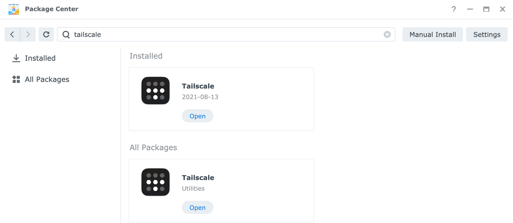
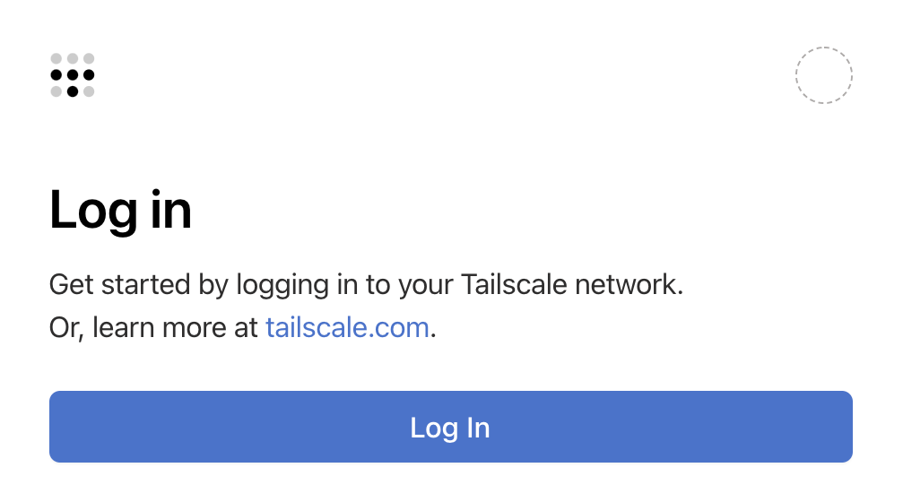

- [cmd](#cmd)
- [packages](#packages)
  - [vim](#vim)
  - [tailscale](#tailscale)
    - [tailscale fast commands for Synology NAS](#tailscale-fast-commands-for-synology-nas)
    - [Access Synology NAS from anywhere](#access-synology-nas-from-anywhere)
      - [Install tailscale on DSM manually](#install-tailscale-on-dsm-manually)
      - [Install using Synology Package Center](#install-using-synology-package-center)
      - [Features and benefits](#features-and-benefits)
      - [Limitations \& known issues](#limitations--known-issues)
      - [Enable outbound connections](#enable-outbound-connections)
      - [Adjust Synology firewall settings](#adjust-synology-firewall-settings)
      - [Troubleshooting](#troubleshooting)
      - [Special thanks](#special-thanks)
- [guides](#guides)
  - [PIA ports for gluetun and firewall](#pia-ports-for-gluetun-and-firewall)
  - [DS File (iOS)](#ds-file-ios)

## cmd

To add an alias or to modify `$PATH` to shell edit or create `~/.bashrc`. See [this discussion](https://www.synoforum.com/threads/how-to-make-an-alias-in-shell.1211/).

```sh
# $PATH
echo 'export PATH="/volume1/@appstore/vim/bin/vim:$PATH"' >> ~/.bashrc

# alias vim
echo 'alias vim="/volume1/@appstore/vim/bin/vim"' >> ~/.bashrc
```

renew Let's Encrypt Certificates

```sh
/usr/syno/sbin/syno-letsencrypt renew-all
```

disable Firewall

```sh
/usr/syno/bin/synofirewall --disable
```

---

## packages

### vim

Install last version of **vim** from [SynoCommunity](https://packages.synocommunity.com/) and enable syntax in it

1. Add [SynoCommunity](https://packages.synocommunity.com/) repo to a Package Center  
   Package Center -> Settings -> Package Sources -> SynoCommunity - <https://packages.synocommunity.com/>

2. Install **vim** from SynoCommunity

3. Ssh to Synology box with your user

   ```sh
   # via $PATH
   echo 'export PATH="/volume1/@appstore/vim/bin/:$PATH"' >> ~/.bashrc && \
     source ./.bashrc && \
     echo -e "filetype plugin indent on\nsyntax on" >> ~/.vimrc && \
     vim --version
   
   # or via alias
   echo 'alias vim="/volume1/@appstore/vim/bin/vim"' >> ~/.bashrc && \
     source ./.bashrc && \
     echo -e "filetype plugin indent on\nsyntax on" >> ~/.vimrc && \
     vim --version
   ```

---

### tailscale

#### tailscale fast commands for Synology NAS

- Stop tailscale

  ```sh
  sudo tailscale down
  ```

- Run tailscale as Subnet router on Synology NAS

  ```sh
  sudo tailscale up --advertise-routes=192.168.1.0/24 --reset
  ```

- Run it after every manual upgrade of tailscale package to preserve outbound connections from Synology NAS to tailnet devices (run it under root to avoid needed reboot)

  ```sh
  /var/packages/Tailscale/target/bin/tailscale configure-host; synosystemctl restart pkgctl-Tailscale.service
  ```

  > - As of 03.09.2024, tailscale MagicDNS is not working on Synology NAS, more info - [tailscale on Synology DSM 7 dns still not working #12498](https://github.com/tailscale/tailscale/issues/12498)
  >
  >   - tailnet IPs are reachable from Synology NAS with:
  >
  >     ```sh
  >     /var/packages/Tailscale/target/bin/tailscale configure-host; synosystemctl restart pkgctl-Tailscale.service
  >     ```
>
  > - As of 03.09.2024, tailscale arguments `--accept-routes` and `--advertise-exit-node` are not working on Synology NAS - [Synology: tracking bug for use cases #1995](https://github.com/tailscale/tailscale/issues/1995)

---

#### [Access Synology NAS from anywhere](https://tailscale.com/kb/1131/synology/)

The best way to install Tailscale on Synology devices is to download and manually install the Tailscale package for DiskStation Manager (DSM). The version of Tailscale that is available in the Synology Package Manager application is updated approximately once per quarter, so downloading the Tailscale app from our package server and installing it on DSM manually will ensure that you can use the most up-to-date version.

##### [Install tailscale on DSM manually](https://tailscale.com/kb/1131/synology#install-tailscale-on-dsm-manually)

1. Download the DSM package from the Tailscale package server site.

   > To determine which download is appropriate for your Synology device, visit the [Synology and SynoCommunity Package Architectures](https://github.com/SynoCommunity/spksrc/wiki/Synology-and-SynoCommunity-Package-Architectures) page and look up your architecture by Synology model. Then, find the SPK download at [Tailscale Packages](https://pkgs.tailscale.com/) that corresponds to your model. Synology packages (SPKs) are available from both [stable](https://pkgs.tailscale.com/stable/#spks) and [unstable](https://pkgs.tailscale.com/unstable/#spks) release tracks.

2. [Manually install](https://kb.synology.com/en-sg/DSM/tutorial/How_to_install_applications_with_Package_Center) the DSM package onto your Synology device

3. After the Tailscale app is installed, follow the instructions to log in to your Tailscale network (known as a tailnet) using your preferred identity provider. If you don't already have a Tailscale account, a free account will be created automatically.

4. After you authenticate to the tailnet, you can connect to your Synology device from your PC, laptop, phone, or tablet by [installing Tailscale on another device](https://tailscale.com/download).

5. The Tailscale daemon [`tailscaled`](https://tailscale.com/kb/1278/tailscaled) should now be running on your Synology device. You can configure it either using the Tailscale package's Synology web UI or using the [Tailscale CLI](https://tailscale.com/kb/1080/cli) over SSH. For instructions on using SSH to access Synology, see [How can I sign in to DSM/SRM with root privilege via SSH?](https://kb.synology.com/en-id/DSM/tutorial/How_to_login_to_DSM_with_root_permission_via_SSH_Telnet).

##### [Install using Synology Package Center](https://tailscale.com/kb/1131/synology#install-using-synology-package-center)

If you do not want to manually install or update Tailscale using our package server site, you can install Tailscale from the Synology Package Center.

Synology Package Center updates Tailscale approximately once per quarter. To use the latest version of Tailscale, you should download the package and install manually.

1. Go to the Synology Package Center ([tutorial](https://kb.synology.com/en-sg/DSM/tutorial/How_to_install_applications_with_Package_Center)).

2. Search for and install the **Tailscale** app.

   

3. After the Tailscale app is installed, follow the instructions to log in to your Tailscale network (known as a tailnet) using your preferred identity provider. If you don't already have a Tailscale account, a free account will be created automatically.

   

4. After you authenticate to the tailnet, you can connect to your Synology device from your PC, laptop, phone, or tablet by [installing Tailscale on another device](https://tailscale.com/download).

##### [Features and benefits](https://tailscale.com/kb/1131/synology#features-and-benefits)

When a Synology NAS device is connected, Tailscale supports the following:

- Log in using a [supported identity provider](https://tailscale.com/kb/1013/sso-providers).
- Access your Synology device from anywhere, [without opening firewall ports](https://tailscale.com/blog/how-nat-traversal-works).
- Share your Synology device with designated Tailscale users, using [node sharing](https://tailscale.com/kb/1084/sharing).
- Restrict and control access to your Synology device using [ACLs](https://tailscale.com/kb/1018/acls).
- Use your Synology device as a [subnet router](https://tailscale.com/kb/1019/subnets) to provide external access to your LAN.
- Designate your Synology device as an [exit node](https://tailscale.com/kb/1103/exit-nodes) for secure internet access for your other tailnet devices from anywhere.

##### [Limitations & known issues](https://tailscale.com/kb/1131/synology#limitations--known-issues)

- If you upgrade Synology from DSM6 to DSM7, you will need to uninstall and then reinstall the Tailscale app. Do not perform the Synology DSM7 upgrade over Tailscale or you may lose your connection during the upgrade.
- If you uninstall then re-install the Tailscale app and the NAS can no longer connect to your tailnet, see the [Troubleshooting](https://tailscale.com/kb/1131/synology#troubleshooting) section for instructions.
- Tailscale uses [hybrid networking mode](https://tailscale.com/kb/1112/userspace-networking) on Synology, which means that if you share subnets, they will be reachable over UDP and TCP, but not necessarily pingable.
- Other Synology packages cannot make outgoing connections to your other Tailscale nodes by default on DSM7. See instructions below to enable.
- Tailscale on Synology currently can do `--advertise-routes` but not `--accept-routes`. This means that if you have other [subnet routers](https://tailscale.com/kb/1019/subnets), devices on those other subnets will not yet be able to reach your NAS or devices on its local subnet.
- [Tailscale SSH](https://tailscale.com/kb/1193/tailscale-ssh) does not run on Synology. You can use the provided SSH server in DSM instead.

Some of these limitations are imposed on Tailscale by the DSM7 sandbox. See our [Synology tracking issue on GitHub](https://github.com/tailscale/tailscale/issues/1995) for the latest status on the above issues.

##### [Enable outbound connections](https://tailscale.com/kb/1131/synology#enable-outbound-connections)

Synology DSM7 introduced tighter restrictions on what packages are allowed to do. If you're running DSM6, Tailscale runs as root with full permissions and these steps are not required.

By default, Tailscale on Synology with DSM7 only allows inbound connections to your Synology device but outbound Tailscale access from other apps running on your Synology is not enabled.

The reason for this is that the Tailscale package does not have permission to create a [TUN device](https://en.wikipedia.org/wiki/TUN/TAP).

To enable TUN, to permit outbound connections from other things running on your Synology device:

1. Make sure you're running Tailscale v1.22.2 or later

2. In Synology, go to **Control Panel** > **Task Scheduler**, select **Create**, and select **Triggered Task**.

3. Select **User-defined script**.

4. When the **Create task** window appears, select **General**.

5. In **General Settings**, enter a task name, select **root** as the user that the task will run for, and select **Boot-up** as the event that triggers the task. Ensure the task is enabled.

6. Select **Task Settings** and enter the following for **User-defined script**.

   ```sh
   /var/packages/Tailscale/target/bin/tailscale configure-host; synosystemctl restart pkgctl-Tailscale.service
   ```

   If you're curious what it does, you can read the [`configure-host` code](https://github.com/tailscale/tailscale/blob/main/cmd/tailscale/cli/configure-synology.go).

7. Select **OK** to save the settings.

8. Reboot your Synology device. Alternatively, to avoid a reboot, run the above user-defined script as root on the device to restart the Tailscale package.

Your TUN settings should now be persisted across reboots of your device.

> Upgrading the Tailscale package will require the above script to run again. When you upgrade Tailscale, run the above script as root, or reboot your Synology device.

##### [Adjust Synology firewall settings](https://tailscale.com/kb/1131/synology#adjust-synology-firewall-settings)

By enabling TUN, Tailscale traffic will be subject to Synology's built-in firewall.

The firewall is disabled by default. However, if you have it enabled, add an exception for the Tailscale subnet, 100.64.0.0/10. In **Main menu** > **Control Panel** > **Security** > **Firewall**, add a firewall rule in the default profile that allows traffic from the source IP subnet 100.64.0.0 with subnet mask 255.192.0.0.

##### [Troubleshooting](https://tailscale.com/kb/1131/synology#troubleshooting)

If your Synology NAS cannot connect to your tailnet after uninstalling and re-installing the Tailscale app, we recommend the following steps:

1. SSH into your NAS and run the command:

   ```sh
   sudo tailscale up
   ```

2. Enter the password for your NAS (if prompted), then copy the provided URL.

   ```sh
   To authenticate, visit:
   https://login.tailscale.com/a/xxxxxxxxxx
   Success.
   ```

3. Paste the URL into your web browser, authenticate to your tailnet, then open the [**Machines**](https://login.tailscale.com/admin/machines) page of the admin console to verify that your NAS is connected to the tailnet.

##### [Special thanks](https://tailscale.com/kb/1131/synology#special-thanks)

Special thanks to [Guilherme de Maio (nirev)](https://github.com/nirev), who contributed the original [Synology-Tailscale package builder](https://github.com/tailscale/tailscale-synology). Tailscale now maintains this package builder and produces our official Synology packages.

---

## guides

### PIA ports for gluetun and firewall

In order to connect to our service using one of the VPN methods we provide, please verify you can connect over these ports:

- For the PIA Client:
  - **UDP** ports  8080, 853, 123, 53
  - **TCP** ports  8443, 853, 443, 80
- For OpenVPN:
  - **UDP** ports 1197, 1198
  - **TCP** ports  501, 502

If you can connect over any of those, you should be able to use at least one of our connection methods.

In addition, the PIA application pings our gateways over port 8888. This is used to connect you to the server with the lowest latency when you use the auto connect feature.

We also have more in-depth information on our OpenVPN ports including the protocols, settings, and certificates that should be used with them in this [article](https://www.privateinternetaccess.com/helpdesk/kb/articles/which-encryption-auth-settings-should-i-use-for-ports-on-your-gateways-3).

---

### DS File (iOS)

It's an old application, so, it's can't normally connect to the NAS via NGINX reverse proxy.

To connect just use something like: `nas.domain.com:443` with enabled **https**
