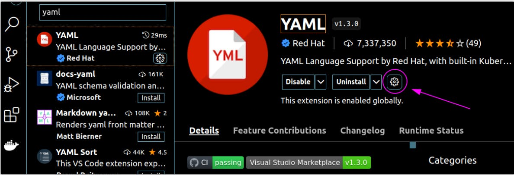

- [File associations](#file-associations)
- [Useful Keybindings](#useful-keybindings)
- [settings.json](#settingsjson)
- [Extensions](#extensions)
  - [YAML](#yaml)
  - [Black Formatter](#black-formatter)
  - [autoDocstring - Python Docstring Generator](#autodocstring---python-docstring-generator)
  - [Best linters list](#best-linters-list)

## File associations

Make **VS Code** default editor for all programming languages.

1. Install `duti` and `python-yq`  

    ```sh
    brew install duti python-yq
    ```

2. Make **VS Code** default editor for all languages known to GitHub [languages.yml](https://raw.githubusercontent.com/github/linguist/master/lib/linguist/languages.yml)

    ```sh
    curl "https://raw.githubusercontent.com/github/linguist/master/lib/linguist/languages.yml" \
      | yq -r "to_entries | (map(.value.extensions) | flatten) - [null] | unique | .[]" \
      | xargs -L 1 -I "{}" duti -s com.microsoft.VSCode {} all
    ```

Use duti to set defaults for specific files to **VS Code**

```sh
# example

duti -s com.microsoft.VSCode public.plain-text all
duti -s com.microsoft.VSCode public.source-code all
duti -s com.microsoft.VSCode public.data all
duti -s com.microsoft.VSCode .css all
duti -s com.microsoft.VSCode .gitattributes all
duti -s com.microsoft.VSCode .gitignore all
duti -s com.microsoft.VSCode .htaccess all
duti -s com.microsoft.VSCode .js all
duti -s com.microsoft.VSCode .json all
duti -s com.microsoft.VSCode .link all
duti -s com.microsoft.VSCode .md all
duti -s com.microsoft.VSCode .mv all
duti -s com.microsoft.VSCode .mvt all
duti -s com.microsoft.VSCode .scss all
duti -s com.microsoft.VSCode .sh all
duti -s com.microsoft.VSCode .txt all
duti -s com.microsoft.VSCode .xml all
duti -s com.microsoft.VSCode .yaml all
duti -s com.microsoft.VSCode .zsh all
```

---

## Useful Keybindings

**Trigger Suggest**  
For example, list tags after `:` in `Dockerfile` in `FROM` section  
`cmd + shift + space`

**Trigger Parameter Hints**  
Useful hints and suggests  
`shift + option + space`

**Reload the current window**  
`cmd + shift + p` -> `Reload`

---

## settings.json

```json
{
    "python.defaultInterpreterPath": "/usr/local/bin/python3",
    "security.workspace.trust.untrustedFiles": "open",
    "editor.wordWrap": "on",
    "editor.rulers": [
        50,
        79
    ],
    "editor.stickyTabStops": true,
    "python.analysis.typeCheckingMode": "off",
    "workbench.editorAssociations": {
        "*.html": "default"
    },
    "files.associations": {
        "*.env": "properties",
    },
    "[python]": {
        "editor.defaultFormatter": "ms-python.black-formatter"
    },
    "[javascript]": {
        "editor.formatOnSave": true,
    },
    "[html]": {
        "editor.formatOnSave": true,
    },
    "[css]": {
        "editor.formatOnSave": true
    },
    "[shellscript]": {
    },
    "[ruby]": {
    },
    "[terraform]": {
        "editor.defaultFormatter": "hashicorp.terraform",
    },
    "[dockercompose]": {
        "editor.defaultFoldingRangeProvider": "redhat.vscode-yaml",
    },
    "[markdown]": {
        "editor.quickSuggestions": {
            "other": true,
            "comments": false,
            "strings": false
        },
        "editor.defaultFormatter": "DavidAnson.vscode-markdownlint"
    },
    "markdownlint.config": {
        "MD028": false,
        "MD036": false,
        "MD010": {
            "code_blocks": false,
        },
        "MD024": false,
    },
    "telemetry.telemetryLevel": "off",
    "docker.images.label": "FullTag",
    "editor.indentSize": "tabSize",
    "window.autoDetectColorScheme": true,
    "git.confirmSync": false,
    "editor.defaultFormatter": "esbenp.prettier-vscode",
    
    // prettier config
    "prettier.singleQuote": true,
    "prettier.arrowParens": "avoid",
    // prettier config end

    "workbench.colorTheme": "Monokai Pro (Filter Spectrum)",
    "editor.linkedEditing": true,
    "editor.tabSize": 2,
}
```

---

## Extensions

### YAML

[How to enable syntax auto-completion for Kubernetes manifest files in Red Hat's YAML plugin for VSCode](https://brain2life.hashnode.dev/how-to-enable-syntax-auto-completion-for-kubernetes-manifest-files-in-red-hats-yaml-plugin-for-vscode)

**Problem:**
When using a plugin for YAML syntax support for VSCode editor developed by Red Hat, it does not enable the auto-completion feature for Kubernetes manifest files by default. As an auto-completion feature, it offers to use the *CTRL + Space* shortcut key. But this may not be a good option to choose, as the plugin has automatic syntax completion for Kubernetes manifest files during typing without using a shortcut key.

**Solution:**

1. Install the plugin in VSCode from [here](https://marketplace.visualstudio.com/items?itemName=redhat.vscode-yaml).

2. On the plugin page click on the gear button and select *Extension Settings*
   

3. Scroll down and in *YAML: Schemas* select *Edit in settings.json*:
   

4. In settings add the following code and save the changes:

   COPY

   ```json
    "yaml.schemas": {
        "kubernetes": "*.yaml"
    }
   ```

5. Restart VSCode.

6. Enjoy auto-completion for Kubernetes manifest files!

---

### Black Formatter

ms-python.black-formatter extension

```json
"python.formatting.provider": "none",
"[python]": {
    "editor.defaultFormatter": "ms-python.black-formatter"
},
```

currently doesn't work

```json
"black-formatter.args": [
    "--line-length 79"
],
"python.formatting.blackArgs": [
    "--line-length 79"
]
```

---

### autoDocstring - Python Docstring Generator

cursor after first `"""`  
generate docstring  
`cmd + shift + A`

---

### Best linters list

[Trunk.io](https://marketplace.visualstudio.com/items?itemName=Trunk.io)

**Linters / Formatters**

| Language                           | Linters                                                      |
| ---------------------------------- | ------------------------------------------------------------ |
| All                                | `codespell`, `cspell`, `gitleaks`, `git-diff-check`          |
| Ansible                            | `ansible-lint`                                               |
| Bash                               | `shellcheck`, `shfmt`                                        |
| Bazel, Starlark                    | `buildifier`                                                 |
| C, C++, Protobuf                   | `clang-format`, `clang-tidy`, `include-what-you-use`         |
| Cloudformation                     | `cfnlint`                                                    |
| CSS, SCSS                          | `stylelint`                                                  |
| Cue                                | `cue-fmt`                                                    |
| Docker                             | `hadolint`                                                   |
| Dotenv                             | `dotenv-linter`                                              |
| GitHub                             | `actionlint`                                                 |
| Go                                 | `gofmt`, `golangci-lint`, `semgrep`, `goimports`             |
| HAML                               | `haml-lint`                                                  |
| Java                               | `semgrep`                                                    |
| JavaScript, TypeScript, YAML, JSON | `eslint`, `prettier`, `semgrep`                              |
| Kotlin                             | `detekt`[1](https://marketplace.visualstudio.com/items?itemName=Trunk.io#note-detekt), `detekt-explicit`[1](https://marketplace.visualstudio.com/items?itemName=Trunk.io#note-detekt), `detekt-gradle`[1](https://marketplace.visualstudio.com/items?itemName=Trunk.io#note-detekt), `ktlint` |
| Markdown                           | `markdownlint`                                               |
| Protobuf                           | `buf-breaking`, `buf-lint`                                   |
| Python                             | `autopep8`, `bandit`, `black`, `flake8`, `isort`, `mypy`, `pylint`, `semgrep`, `yapf` |
| Ruby                               | `brakeman`, `rubocop`, `rufo`, `semgrep`, `standardrb`       |
| Rust                               | `clippy`, `rustfmt`                                          |
| Scala                              | `scalafmt`                                                   |
| SQL                                | `sql-formatter`, `sqlfluff`                                  |
| SVG                                | `svgo`                                                       |
| Terraform                          | `terraform` (`validate` and `fmt`), `tflint`[2](https://marketplace.visualstudio.com/items?itemName=Trunk.io#note-tflint) |
| TOML                               | `taplo`                                                      |
| YAML                               | `prettier`, `semgrep`, `yamllint`                            |

---
