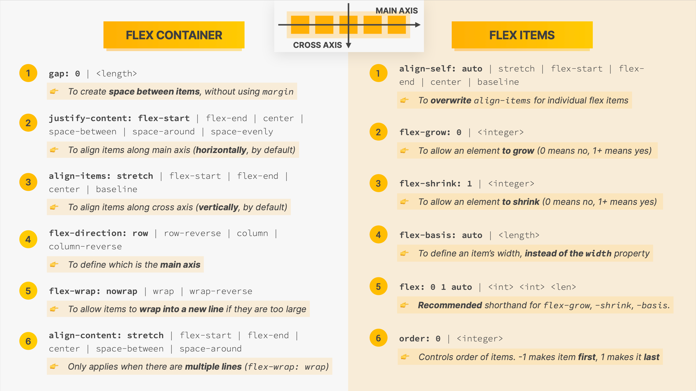
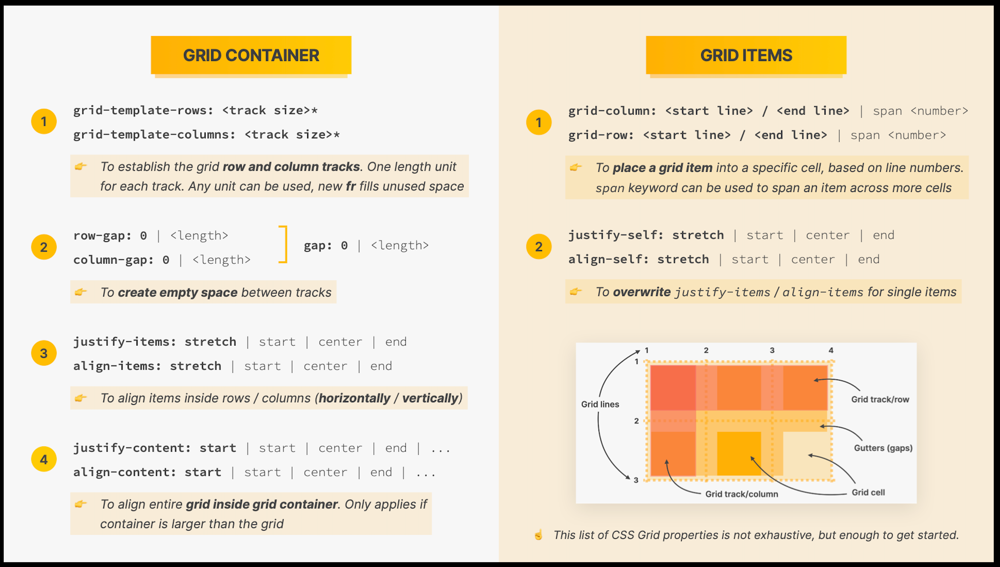

- [Flexbox](#flexbox)
  - [Flexbox properties](#flexbox-properties)
    - [Flexbox main properties](#flexbox-main-properties)
      - [Flex Container](#flex-container)
      - [Flex Items](#flex-items)
- [CSS Grid](#css-grid)
  - [CSS Grid main properties](#css-grid-main-properties)
    - [Grid Container](#grid-container)
    - [Grid Items](#grid-items)

## Flexbox

### Flexbox properties

`flex` property defaults

```css
flex-grow: 0; /* To allow an element to grow (0 means no, 1+ means yes) */
flex-shrink: 1; /* To allow an element to shrink (0 means no, 1+ means yes) */
flex-basis: auto; /* To define an item’s width, instead of the width property */
```

`flex: 1;` means:

```css
flex-grow: 1; /* The div will grow in same proportion as the window-size */
flex-shrink: 1; /* The div will shrink in same proportion as the window-size */
flex-basis: 0; /* The div does not have a starting value as such and will take up screen as per the screen size available for e.g:- if 3 divs are in the wrapper then each div will take 33%. */
```

#### Flexbox main properties

- Flexbox is a set of related **CSSproperties** for **building 1-dimensional layouts**
- The main idea behind flexbox is that empty space inside a container element can be **automatically divided** by its child elements
- Flexbox makes it easy to automatically **align items to one another** inside a parent container, both horizontally and vertically
- Flexbox solves common problems such as **vertical centering** and creating **equal-height columns**
- Flexbox is perfect for **replacing floats**, allowing us to write fewer and cleaner HTML and CSS code



##### Flex Container

| #    | Name             | Default value | Values                                                       | Description                                                  | Notes            |
| ---- | ---------------- | ------------- | ------------------------------------------------------------ | ------------------------------------------------------------ | ---------------- |
| 1    | gap:             | 0             | `lenth`                                                      | To create **space between items***, without using margin     |                  |
| 2    | justify-content: | flex-start    | flex-end / center / space-between / space-around / space-evenly | To align items along main axis (**horizontally**, by default) |                  |
| 3    | align-items:     | stretch       | flex-start / flex-end / center / baseline                    | To align items along cross axis (**vertically**, by default) |                  |
| 4    | flex-direction:  | row           | row-reverse / column / column-reverse                        | To define which is the **main axis**                         |                  |
| 5    | flex-wrap:       | nowrap        | wrap / wrap-reverse                                          | To allow items to **wrap into a new line** if they are too large | Advanced feature |
| 6    | align-content:   | stretch       | flex-start / flex-end / center / space-between / space-around | Only applies when there are **multiple lines** (flex-wrap: wrap) | Advanced feature |

##### Flex Items

| #    | Name         | Default value | Values                                               | Description                                                  | Notes |
| ---- | ------------ | ------------- | ---------------------------------------------------- | ------------------------------------------------------------ | ----- |
| 1    | align-self:  | auto          | stretch / flex-start / flex- end / center / baseline | To **overwrite** align-items for individual flex items       |       |
| 2    | flex-grow:   | 0             | `integer`                                            | To allow an element **to grow** (0 means no, 1+ means yes)   |       |
| 3    | flex-shrink: | 1             | `integer`                                            | To allow an element **to shrink** (0 means no, 1+ means yes) |       |
| 4    | flex-basis:  | auto          | `length`                                             | To define an item’s width, **instead of the width** property |       |
| 5    | flex:        | 0 1 auto      | `integer` `integer` `lenth`                          | **Recommended** shorthand for flex-grow, -shrink, -basis.    |       |
| 6    | order:       | 0             | `integer`                                            | Controls order of items. -1 makes item **first**, 1 makes it **last** |       |

---

## CSS Grid

### CSS Grid main properties

- CSS Grid is a set of **CSSproperties** for **building 2-dimensional layouts**
- The main idea behind CSS Grid is that we **divide a container element into rows and columns** that can be filled with its child elements
- In two-dimensional contexts, CSS Grid allows us to write **less nested HTML** and **easier-to-read CSS**
- CSS Grid is **not meant to replace flexbox**! Instead, they work perfectly together. Need a **1D** layout? Use flexbox. Need a **2D** layout? Use CSS Grid.



#### Grid Container

| #    | Name                   | Default value | Values                        | Description                                                  | Notes |
| ---- | ---------------------- | ------------- | ----------------------------- | ------------------------------------------------------------ | ----- |
| 1    | grid-template-rows:    | -             | `track size` (px or fr), auto | To establish the grid **row and column tracks**. One length unit for each track. Any unit can be used, new **fr** fills unused space |       |
|      | grid-template-columns: | ⬆             | ⬆                             | ⬆                                                            |       |
| 2    | row-gap:               | 0             | `length`                      | To **create empty space** between tracks                     |       |
|      | column-gap             | ⬆             | ⬆                             | ⬆                                                            |       |
| 3    | justify-items:         | stretch       | start / center / end          | To align items inside rows / columns (**horizontally / vertically**) |       |
|      | align-items:           | ⬆             | ⬆                             | ⬆                                                            |       |
| 4    | justify-content:       | start         | start / center / end / ...    | To align entire **grid inside grid container**. Only applies if container is larger than the grid |       |
|      | align-content:         | ⬆             | ⬆                             | ⬆                                                            |       |

#### Grid Items

| #    | Name          | Default value             | Values               | Description                                                  | Notes |
| ---- | ------------- | ------------------------- | -------------------- | ------------------------------------------------------------ | ----- |
| 1    | grid-column:  | `start line` / `end line` | span `number`        | To **place a grid item** into a specific cell, based on line numbers. span keyword can be used to span an item across more cells |       |
|      | grid-row:     | ⬆                         | ⬆                    | ⬆                                                            |       |
| 2    | justify-self: | stretch                   | start / center / end | To **overwrite** justify-items / align-items for single items |       |
|      | align-self:   | ⬆                         | ⬆                    | ⬆                                                            |       |
