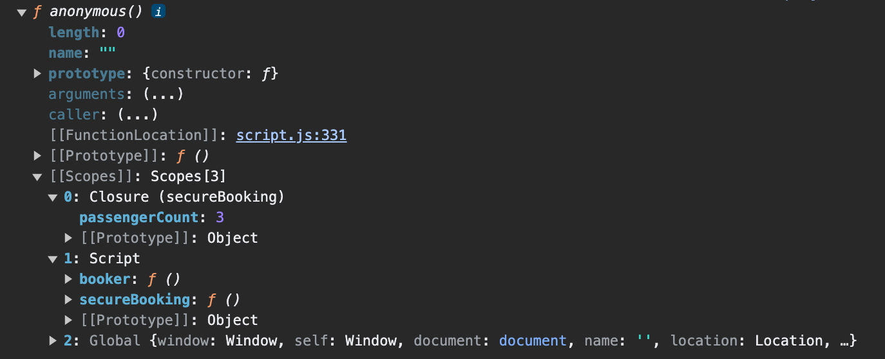
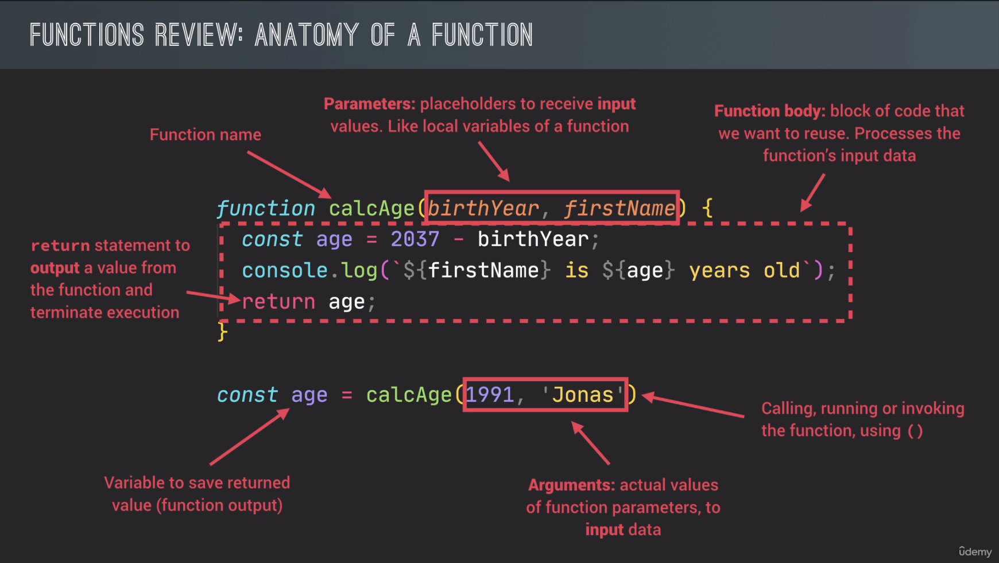

- [Built-in operators and directives](#built-in-operators-and-directives)
  - [console.dir](#consoledir)
  - [typeof](#typeof)
  - [let, const](#let-const)
  - [use strict](#use-strict)
  - [debugger](#debugger)
  - [Math method](#math-method)
- [Built-in Data Structures](#built-in-data-structures)
  - [Arrays](#arrays)
  - [Sets](#sets)
  - [Objects](#objects)
  - [Maps](#maps)
- [Functions](#functions)
  - [1. Function's anatomy](#1-functions-anatomy)
  - [2. Three ways of writing functions](#2-three-ways-of-writing-functions)
    - [Function declarations](#function-declarations)
    - [Function expressions](#function-expressions)
    - [Arrow functions](#arrow-functions)
- [Document](#document)
  - [Elements and properties](#elements-and-properties)
    - [Element: classList property](#element-classlist-property)
- [Notes and guides](#notes-and-guides)
  - [1. Notes](#1-notes)
    - [Little Tips](#little-tips)
    - [Dot Notation vs Bracket Notation for Object Properties – What's the Difference?](#dot-notation-vs-bracket-notation-for-object-properties--whats-the-difference)
      - [1. Dot Notation Property Accessor](#1-dot-notation-property-accessor)
      - [2. Bracket Notation Property Accessor](#2-bracket-notation-property-accessor)
      - [3. Differences between Dot Notation and Bracket Notation Property Accessor](#3-differences-between-dot-notation-and-bracket-notation-property-accessor)
        - [3.1 Using both approaches for accessing properties](#31-using-both-approaches-for-accessing-properties)
        - [3.2 Using both approaches for modifying properties](#32-using-both-approaches-for-modifying-properties)
      - [4. Should You Use Dot or Bracket Notation?](#4-should-you-use-dot-or-bracket-notation)
    - [JSdoc and VSCode](#jsdoc-and-vscode)
    - [Operator Precedence Table](#operator-precedence-table)
    - [Javascript: Simplified Type Coercion](#javascript-simplified-type-coercion)
      - [1. Operate on incompatible types](#1-operate-on-incompatible-types)
        - [String Coercion](#string-coercion)
        - [Number Coercion](#number-coercion)
        - [Boolean Coercion](#boolean-coercion)
      - [2. Output object or variable](#2-output-object-or-variable)
  - [2. Guides](#2-guides)
    - [How to extract data from response body (JSON \& XML) in Postman](#how-to-extract-data-from-response-body-json--xml-in-postman)
      - [Example with Gluetun servers.json](#example-with-gluetun-serversjson)

## Built-in operators and directives

### console.dir

`console.dir` - print to the console everything about object/variable/anything

```js
'use strict';

const secureBooking = function () {
  let passengerCount = 0;

  return function () {
    passengerCount++;
    console.log(`${passengerCount} passengers`);
  };
};

const booker = secureBooking();

booker(); // 1 passengers
booker(); // 2 passengers
booker(); // 3 passengers

console.dir(booker);
// output
```



### typeof

`typeof` - shows type of variable

```js
let year;
console.log(year);
console.log(typeof year);

// output
undefined
undefined

year = 1991;
console.log(typeof year);

// output
number
```

**js** has a bug with `typeof null`

Actually `null` is `undefined`, but for legacy reasons it is kept as `object`

```js
console.log(typeof null);

// output
object
```

---

### let, const

`let`, `const` are for variable declaration

`let` - variable can be changed later

`const` - variable can't be changed later

> By default use `const`, and use `let` only when you are really sure that you need mutable variable.
>
> Never use `var`, it's like `let` but legacy pre-ES6 and function-scoped. And `let` is block-scoped.
>
> Use `var` only in block elements (`if`, `for` etc.), because `const` and `let` will be scoped to block and `var` will be function-scoped if block inside function. Or `var` will be in global scope if block is outside the function

examples

```js
let javascriptIsFun = true;
javascriptIsFun = "YES!"; //change variable type and value

let age = 30;
age = 31; // change variable value

const birthYear = 1991;
// birthYear = 1990; // can't do this

// const job; // can't do this
```

By this way, JS creates a property on the global object, not just variable, so **NEVER** use it to just declare variables

```js
lastName = "Schmedtmann";
console.log(lastName);
```

---

### use strict

`'use strict';`

> The `"use strict"` directive was new in ECMAScript version 5. It is not a statement, but a literal expression, ignored by earlier versions of JavaScript. The purpose of `"use strict"` is to indicate that the code should be executed in "strict mode". With strict mode, you can not, for example, use undeclared variables. All modern browsers support "use strict" except Internet Explorer 9 and lower. You can use strict mode in all your programs. It helps you to write cleaner code, like preventing you from using undeclared variables. `"use strict"` is just a string, so IE 9 will not throw an error even if it does not understand it.

---

### debugger

Use `debugger;` to make a breakpoint in code anywhere.

Or use breakpoints in browser.

---

### Math method

> `Math.random` example

```js
const number = Math.trunc(Math.random() * 20) + 1;
```

- `Math.random` - gives random number between 0 and 1
- `Math.trunc` - gets rid of decimal part

- `* 20` - specifying the range between 0 and 19 or 19.9999... if without Math.trunc

- `+ 1` - specifying the range between 1 and 20

---

## [Built-in Data Structures](https://developer.mozilla.org/en-US/docs/Web/JavaScript/Reference/Global_Objects)

### Arrays

```js
tasks = ['Code', 'Eat', 'Code'];
// ["Code", "Eat", "Code"]
```

- Use when you need **ordered** list of values (might contain duplicates)
- Use when you need to **manipulate** data

### Sets

```js
tasks = new Set(['Code', 'Eat', 'Code']);
// {"Code", "Eat"}
```

- Use when you need to work with **unique** values
- Use when **high-performance** is *really* important
- Use to **remove duplicates** from arrays

### Objects

```js
task = {
  task: 'Code',
  date: 'today',
  repeat: true,
};
```

- More “traditional” key/value store (“abused” objects)
- Easier to write and access values with `.` and `[]` (dots and brackets notations)

Use cases:

- Use when you need to include **functions** (methods)
- Use when working with JSON (can convert to map)

### Maps

```js
task = new Map([
  ['task', 'Code'],
  ['date', 'today'],
  [false, 'Start coding'],
]);
```

- Better performance
- Keys can have **any** data type
- Easy to iterate
- Easy to compute size

Use cases:

- Use when you simply need to map key to values
- Use when you need keys that are **not** strings

---

## Functions

### 1. Function's anatomy



### 2. Three ways of writing functions

Three different ways of writing functions, but they all work in a similar way:

- receive **input** data
- **transform** data
- **output** data

#### Function declarations

Can be used before it's declared

```js
function calcAgeDe(birthYear) {
  return 2037 - birthYear;
}
```

#### Function expressions

Function value stored on a varibale

```js
const calcAgeEx = function(birthYear) {
  return 2037 - birthYear;
};
```

#### Arrow functions

Great for a quick one-line functions

Has no `this` keyword

```js
const calcAgeAr = birthYear => 2037 - birthYear;
```

---

## [Document](https://developer.mozilla.org/en-US/docs/Web/API/Document)

### [Elements and properties](https://developer.mozilla.org/en-US/docs/Web/API/Element)

#### [Element: classList property](https://developer.mozilla.org/en-US/docs/Web/API/Element/classList)

Although the `classList` property itself is read-only, you can modify its associated `DOMTokenList` using the [`add()`](https://developer.mozilla.org/en-US/docs/Web/API/DOMTokenList/add), [`remove()`](https://developer.mozilla.org/en-US/docs/Web/API/DOMTokenList/remove), [`replace()`](https://developer.mozilla.org/en-US/docs/Web/API/DOMTokenList/replace), and [`toggle()`](https://developer.mozilla.org/en-US/docs/Web/API/DOMTokenList/toggle) methods.

Example modifying classes in element with class `.player--0`

```js
const player0El = document.querySelector('.player--0');

player0El.classList.add('player--active');
player0El.classList.remove('player--active');
player0El.classList.replace('player--active');

// toggle() works like a switcher. If class present it removes it and vice versa
player0El.classList.toggle('player--active');
```

---

## Notes and guides

### 1. Notes

#### Little Tips

`__` - is a placeholder for unnecessary parameter or variable

```js
const currenciesUnique = new Set(['USD', 'GBP', 'USD', 'EUR', 'EUR']);
console.log(currenciesUnique);
currenciesUnique.forEach(function (value, _, map) {
  // Value and key here are the same thing - value, because Sets don't have keys at all
  // But callback function designed with 3 arguments as others to preserve order
  // _ - for JS it's a placeholder for unnecessary variable or parameter
  console.log(`${value}: ${value}`);
});
```

---

#### [Dot Notation vs Bracket Notation for Object Properties – What's the Difference?](https://www.freecodecamp.org/news/dot-notation-vs-square-brackets-javascript/)

There are multiple ways to access object properties in JavaScript. But two common ones are dot notation and bracket notation.

I'll explain the difference between these two approaches in this article.

With dot and bracket notation, you can:

- access the value of a property by its key
- modify the value of an existing property by its key and
- add a new property to an object

But these two ways access properties differently, and there are different scenarios when one is better than the other.

##### 1. Dot Notation Property Accessor

The Dot Notation approach involves using a dot or period (`.`) and a key to access a property. Here's the syntax:

```js
object.key
```

You have the dot then the key of the property you want to access. This expression will return the value of the property. Let's see an example:

```js
const obj = {
  name: "deeecode",
  age: 80,
  language: "javascript",
}

const target = obj.name
// deeecode
```

By using dot and the **name** key, `.name`, we get "deeecode" which is the value of the name property.

You can also use this notation to modify an existing property:

```js
const obj = {
  name: "deeecode",
  age: 80,
  language: "javascript",
}

obj.age = 100

console.log(obj)
// {
//   name: "deeecode",
//   age: 100,
//   language: "javascript"
// }
```

Here, we modify the `age` property.

Also, you can add a new property using this approach:

```js
const obj = {
  name: "deeecode",
  age: 80,
  language: "javascript",
}

obj.location = "Mercury"

console.log(obj)
// {
//   name: "deeecode",
//   age: 80,
//   language: "javascript",
//   location: "Mercury"
// }
```

Here, we add the `location` property.

But this approach has limitations which we'll look at soon. Next, let's understand how the bracket notation approach works.

Here's a [video version](https://youtu.be/AzVvBO65SMc) for this topic if you're interested.

##### 2. Bracket Notation Property Accessor

The Bracket Notation approach involves using square brackets, in which you have an expression that evaluates to a value. That value serves as a key for accessing the property. Here's the syntax:

```js
object[expression]
```

The expression within the brackets evaluates to a key for the property you want to access, and this expression will return the value of the property. Let's see an example:

```js
const obj = {
  name: "deeecode",
  age: 80,
  language: "javascript",
}

const target = obj["name"]
// deeecode
```

By using square brackets and a **"name"** string expression, `["name"]`, we get "deeecode" which is the value of the name property.

You can also use this approach to modify an existing property:

```js
const obj = {
  name: "deeecode",
  age: 80,
  language: "javascript",
}

obj["age"] = 100

console.log(obj)
// {
//   name: "deeecode",
//   age: 100,
//   language: "javascript"
// }
```

Here, we modify the `age` property using an `"age"` string expression.

And, you can add a new property using square brackets:

```js
const obj = {
  name: "deeecode",
  age: 80,
  language: "javascript",
}

obj["location"] = "Mercury"

console.log(obj)
// {
//   name: "deeecode",
//   age: 80,
//   language: "javascript",
//   location: "Mercury"
// }
```

Here, we add a new `location` property using a `"location"` string expression.

The bracket notation has more capabilities than the dot notation. I'll explain.

##### 3. Differences between Dot Notation and Bracket Notation Property Accessor

Dot Notation only allows static keys while Bracket Notation accepts dynamic keys. Static key here means that the key is typed directly, while Dynamic key here means that the key is evaluated from an expression.

Let's look at some examples.

###### 3.1 Using both approaches for accessing properties

Starting with dot notation:

```js
const obj = {
  name: "deeecode",
  age: 80,
  language: "javascript",
}

const myKey = "language"

const target = obj.myKey
// undefined
```

Here, I assigned the value "language" to a `myKey` variable. What I would expect here is that when I use the dot notation, like `obj.myKey`, "myKey", should be replaced with "language". So it would read as `obj.language` and that would return "javascript".

But that's not what happens. Instead, the result is `undefined`.

The reason for this is that Dot Notation only accepts static keys. So when you do `obj.myKey`, JavaScript looks for the property with the key `myKey` in `obj`. But that property does not exist, so we get `undefined`.

The Bracket Notation, on the other hand, allows dynamic keys. Because this notation accepts expressions, you can use any expression that evaluates to a value. It could be:

- `hello + Hi` which evaluates to `helloHi` as a key
- `returnKey()` which evaluates to value as a key
- `isTrue ? "trueKey" : "falseKey"` which evaluates to "trueKey" or "falseKey" as a key
- `variable` which evaluates to the value of the variable as a key

Therefore, using the previous example, we can have this:

```js
const obj = {
  name: "deeecode",
  age: 80,
  language: "javascript",
}

const myKey = "language"

const target = obj[myKey]
// javascript
```

The expression we passed to the square brackets is `myKey` which is a variable. This expression evaluates to "language" which is the value of the variable. Using this value, the square brackets can get the value of the property, which is "javascript".

But if you pass a string expression like `"myKey"`, you get `undefined`:

```js
const obj = {
  name: "deeecode",
  age: 80,
  language: "javascript",
}

const myKey = "language"

const target = obj["myKey"]
// undefined
```

This is because the string expression `"myKey"` evaluates to the value `"myKey"` which serves as the key for accessing the property. Since there's no `myKey` key on `obj`, the returned value is `undefined`.

###### 3.2 Using both approaches for modifying properties

Starting with dot notation:

```js
const obj = {
  name: "deeecode",
  age: 80,
  language: "javascript",
}

const myKey = "age"

obj.myKey = 100

console.log(obj)
// {
//   name: "deeecode",
//   age: 80,
//   language: "javascript",
//   myKey: 100
// }
```

Here, we have `myKey` with the "age" value. By attempting to do `obj.myKey = 100` to modify the `age` property, it will not work. This is because the dot notation accepts a static key. So `obj.myKey` takes `myKey` as a key. Since `mykey` does not exist in `obj`, this statement adds the key. Then, `obj` has a new key, `myKey` with the value `100`.

The behavior is different with the bracket notation:

```js
const obj = {
  name: "deeecode",
  age: 80,
  language: "javascript",
}

const myKey = "age"

obj[myKey] = 100

console.log(obj)
// {
//   name: "deeecode",
//   age: 100,
//   language: "javascript"
// }
```

Instead of adding a new `myKey` property to `obj`, the brackets approach modifies the `age` property. The reason is, we pass `myKey` as an expression to the square brackets. This expression, as a variable, evaluates to `"age"` which is the value of the variable. Using "age" as a key, this approach modifies the value of the `age` property to `100`.

And if we wanted to add a new property using square brackets, then we can pass an expression that returns a new key that does not exist. For example:

```js
const obj = {
  name: "deeecode",
  age: 80,
  language: "javascript",
}

const myKey = "location"

obj[myKey] = "Mercury"

console.log(obj)
// {
//   name: "deeecode",
//   age: 100,
//   language: "javascript",
//   location: "Mercury"
// }
```

Here, the `myKey` variable holds a new value: `"location"`. By passing this to square brackets, and assigning a value of "Mercury", we now have a new property with key-value pair of `location` and "Mercury".

##### 4. Should You Use Dot or Bracket Notation?

So far, we've looked at how each notation works, using different examples for accessing/modifying existing properties and for adding new properties. So which should you use when writing JavaScript code?

The main factor that will help you make your decision is the key of the property you want to access. If it is a static key, use Dot Notation. But if it is a dynamic key (evaluated from an expression during runtime), use Bracket Notation.

Dot Notation is useful when you know the property ahead of time. You simply do `object.key` to read/modify an existing property or to add a new property.

Bracket Notation is useful when you want to [dynamically access a property](https://freecodecamp.org/news/how-to-set-dynamic-object-properties-using-computed-property-names/). The key of this property could come from expressions like `getKey()`, `"my" + "key"`, or `keyVariable`.

I hope you learnt something from the piece. Please share if you found it helpful :)

---

#### JSdoc and VSCode

Sometimes VSCode won't recognise some elements as HTML elements and won't suggest autocompletion. Use **JSdoc** comments to specify object type

Example:

```js
/** @type {HTMLElement} */

const openModal = function () {
  modal.classList.remove('hidden');
  
  // or use CSS property, but do it when you have not many styles
  // here there will be no autocompletion without JSdoc /** @type {HTMLElement} */
  // modal.style.display = 'block';
  
  overlay.classList.remove('hidden');
};
```

More info:

- [Jscript element.style dont working in script.js (visual studio code)](https://stackoverflow.com/questions/53794004/jscript-element-style-dont-working-in-script-js-visual-studio-code)
- [What does it means on javascript? " /** @type {HTMLElement} */ "](https://stackoverflow.com/questions/71400456/what-does-it-means-on-javascript-type-htmlelement)

---

#### [Operator Precedence Table](https://developer.mozilla.org/en-US/docs/Web/JavaScript/Reference/Operators/Operator_precedence#table)

The following table lists operators in order from highest precedence (18) to lowest precedence (1).

Several notes about the table:

1. Not all syntax included here are "operators" in the strict sense. For example, spread `...` and arrow `=>` are typically not regarded as operators. However, we still included them to show how tightly they bind compared to other operators/expressions.
2. The left operand of an exponentiation `**` (precedence 13) cannot be one of the unary operators with precedence 14 without grouping, or there will be a [`SyntaxError`](https://developer.mozilla.org/en-US/docs/Web/JavaScript/Reference/Global_Objects/SyntaxError). That means, although `-1 ** 2` is technically unambiguous, the language requires you to use `(-1) ** 2` instead.
3. The operands of nullish coalescing `??` (precedence 3) cannot be a logical OR `||` (precedence 3) or logical AND `&&` (precedence 4). That means you have to write `(a ?? b) || c` or `a ?? (b || c)`, instead of `a ?? b || c`.
4. Some operators have certain operands that require expressions narrower than those produced by higher-precedence operators. For example, the right-hand side of member access `.` (precedence 17) must be an identifier instead of a grouped expression. The left-hand side of arrow `=>` (precedence 2) must be an arguments list or a single identifier instead of some random expression.
5. Some operators have certain operands that accept expressions wider than those produced by higher-precedence operators. For example, the bracket-enclosed expression of bracket notation `[ … ]` (precedence 17) can be any expression, even comma (precedence 1) joined ones. These operators act as if that operand is "automatically grouped". In this case we will omit the associativity.

---

#### [Javascript: Simplified Type Coercion](https://dev.to/urstrulyvishwak/simplified-type-coercion-in-js-36ge)

**Type Coercion:** Automatic conversion of a value from one data type to another data type is called Type Coercion or implicit type conversion. Javascript engine does this in different scenarios. Let's see where and when this conversion happens and what to remember while coding.

> **Declaimer:** Javascript supports explicit conversion as well and my topic is not that hence I am not covering any of its content though it is closely related.

So here,

`date type` - string, number, boolean, function, and object in Javascript.

> 🧐 Rule: all primitive types conversion happens to: string, number or boolean

Coercion generally means `the practice of persuading someone to do something by using force or threats.` - According to Google. Thanks, Google.

Hence, the `Javascript engine` does the same in converting the value from one type to another without your intervention. Ok. When does this generally happen in Javascript?

Yes. Instead of returning an error, it will do type coercion in the following scenarios:

1. Operate on incompatible types.
2. Output object or variable.

Not to worry if you don't get the above points instantly, I would definitely make you remember forever by end of this article.

Let's start:

##### 1. Operate on incompatible types

###### String Coercion

**Operator +:** By default used for adding numbers. This also does some other work when used with strings i.e. concatenation. That is where coercion comes in to picture.

> 🧐 Rule: If any operand is a string and operated with + then the result is always concatenated and the result is a string.

```js
console.log('str' + 1); // str1
console.log('str' + true); // strtrue
console.log('str' + null); //strnull
console.log('str' + undefined); //strundefined
console.log('str' + NaN); //strNaN
```

###### Number Coercion

Operators /, -, *, %: Division, Subtraction, Multiplication, Modulus in order.

> 🧐 Rule: When you operate string numbers with these operators then result will Number. If one or both operands are non-numeric then result will be NaN

```js
console.log('4' - 2); // 2
console.log('4' % 2); // 0
console.log('4' / 2); // 2
console.log('4' * 2); // 8
console.log('4' - NaN); // NaN
console.log('4' / 'str'); // NaN
console.log('4' / undefined); // NaN
```

**== Equality operator:** Used to compare values irrespective of their types. So,

> 🧐 Rule: == operator coerces to number by default except in case of null. null is always equal to null or undefined.

```js
console.log(1 == 1); // true
console.log(1 == '1'); // true - string 1 ocnverts to number. Hence both are equal.
console.log(1 == true); // true - true converts to number 1.
console.log(true == true); // true - 1 == 1 - true
console.log('true' == true); // false. String true converted to NaN. Hence result is false.
console.log('' == 0); // true

// Number coercion won't happen in case of null.
console.log(null == undefined); // true
console.log(null == null); // true
```

> Best Practice: Always use === instead of ==.

###### Boolean Coercion

Happens with logical operators (||, && and !) and logical context.

```js
// Logical context. if statement evaluates to boolean.
// Here number coerced to true.
if (4) {
    console.log('4 is not boolean');
}
```

```js
// evaluated with coerced values as true && true and returns operand as result.

console.log(2 && 4); // 4
console.log(0 || 5); // 5
console.log(!!2); // true
```

> 🧐 Rule: 0, -0, undefined, null, '', false, NaN are falsy as per Javascript engine any other thing is true.

##### 2. Output object or variable

Javascript can output data in different ways like setting `innerHTML, alert(123), console.log` etc.

> 🧐 Rule: In all the ways, the exposed object or variable is coerced to a string.

We are done. Anything below you can read out of your interest.

---

There are a few things that make coercion looks hard to remember. You don't really need to remember any of the below scenarios.

There are many weird scenarios around different operators that result in different results. Here are the examples.

```js
{}+[]+{}
!! 'false' == !! 'false'
['1'] == 1
new Date() + 0
new Date() - 0
[] + null
'4' * new Array();
'4' / new String();
4 + true
```

> Best Practice: Ignore them 😆.

All of them have answers and nothing returns an error. I didn't provide the answer intentionally.

Let's talk practically,

Did you ever use this type of validation in your code?

If your answer is:

yes - don't do it.

no - don't try to use it.

What if the interviewer asks this question?

Most probably, questions asked in the following way:

1. Asks valid coercion question
2. Common sense related

Say,

`1+2+'str' -> 3 + 'str' -> 3str ->` first two are numbers hence added and as per string coercion second part is concatenated.

`'str'+1+2 - str1 + 2 -> str12` - You might have understood.

Execution happens from left to right.

Even if someone asks some weird scenario, you can say that this won't be legitimate coercion it might give some vague result. I don't think this question won't be a deciding factor for the selection.😃

I would suggest having a look at the table shown on this page:

[type conversion](https://www.w3schools.com/js/js_type_conversion.asp)

whenever possible. It will be useful.

Hope I have cleared confusion around `Type Coercion` in Javascript. Please do comment if I miss any valid coercion examples. I will update the article anytime.

---

### 2. Guides

#### How to extract data from response body (JSON & XML) in Postman

Guides

- [How to extract data from response body (JSON & XML) in Postman](https://medium.com/@banait.ankita/how-to-extract-data-from-response-body-json-xml-in-postman-3fe134e2d8ed)
- [Extract value from a JSON Response Body via the Test Scripts](https://community.postman.com/t/extract-value-from-a-json-response-body-via-the-test-scripts/11835)

##### Example with Gluetun servers.json

1. Paste full JSON output from Postman `GET` request in [JSON Path Finder](https://jsonpathfinder.com/)

2. Find specific path and copy it:

   ```js
   // Example with Gluetun servers.json
   x["private internet access"].servers
   // or
   x.privatevpn.servers
   
   // x is just a var
   ```

3. Postman -> GET -> Tests:

   ```js
   const responseData = pm.response.json();
   console.log(responseData["private internet access"].servers);
   
   // or
   const responseData = pm.response.json();
   console.log(responseData.privatevpn.servers);
   
   // or
   const bodydata = JSON.parse(responseBody);
   console.log(bodydata["private internet access"].servers)
   ```

4. Show Postman Console and there check `Hide Network`

5. Copy all data to any file from console and inspect it.

---
